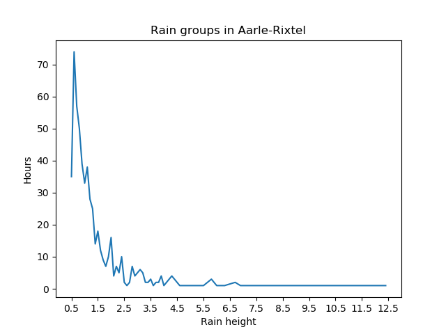
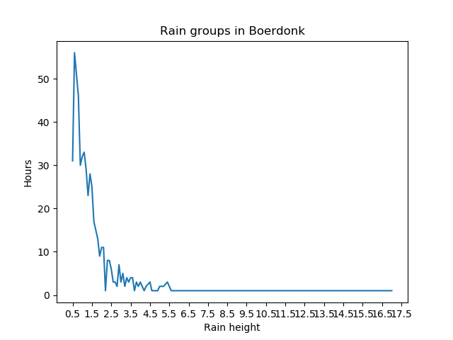
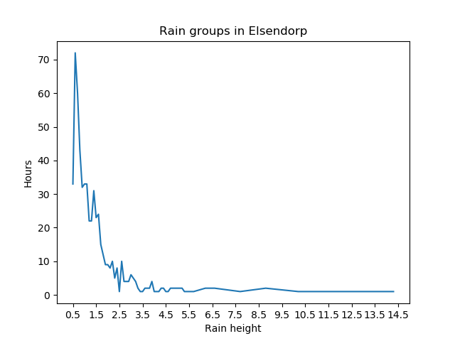
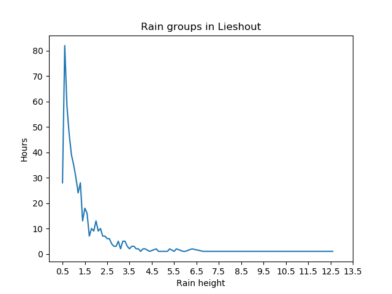
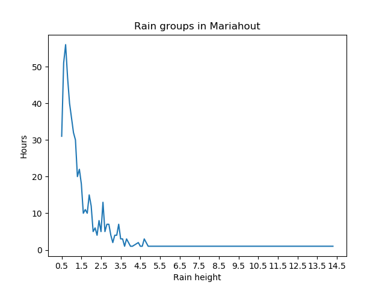

## analyzeRainGroups.py  
```analyseRain(region)```  
Reads data from file with rain data and calculates average rain height for all the rain areas in pumping area (the values are filtered by min_rain values which is 0.5mm by default). The rounded (%1f) and aggreagated by count values are sorted by count (hours of rains) and ploted (x - rain height, y - hours)  
  
  
  
  
  
  
  
!  
[Rips](images/Rips.png)  