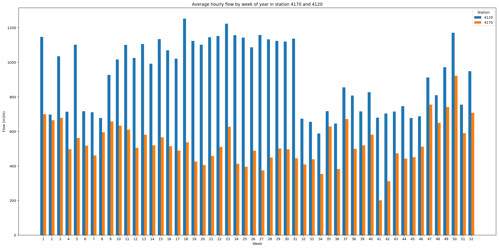

In order to see if there's a pattern through out the year, we plot the average water flow in two pumping stations in each week. Two stations 4120 and 4170 are selected since their flow are significantly higher than the others. 

Station 4120

Station 4170

Finally we put the number of two stations together
